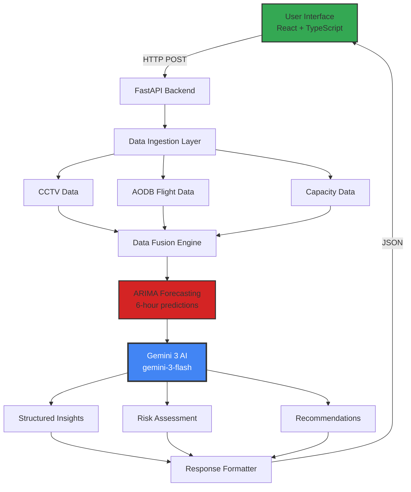

# AirFlow-AI: Proactive Airport Congestion Prediction System ✈️
## 🏗️ Architecture

AirFlow AI is a high-availability "Digital Twin" platform designed to shift airport operations from reactive firefighting to proactive management. By combining statistical **ARIMA forecasting** with **Gemini 3 Flash** strategic reasoning, the system identifies terminal congestion risks up to 6 hours in advance.

## 🚀 Key Features
* **Hybrid Intelligence Pipeline:** Merges time-series math (ARIMA) with large language model (LLM) reasoning.
* **Operational Resilience:** Features a custom **Circuit Breaker pattern** to ensure 24/7 availability even during API service disruptions.
* **Grounded Reasoning:** AI recommendations are calibrated against **IATA Level of Service (LoS) C** standards and **LAX October 2025** traffic baselines.
* **Emergency Mitigation:** Automatically generates "Code Red" protocols for capacity breaches (e.g., ground stops, security re-screening).

## 🛠️ Technical Architecture

### 1. Data & Forecasting Engine (`arima.py`)
Generates 15-minute interval passenger flow predictions. It establishes a statistical "floor" by identifying daily waves and peak periods.

### 2. Resilience Layer (`gemini_reasoning.py` & `app_with_circuit_breaker.py`)
To ensure mission-critical reliability, we implemented a **Circuit Breaker**:
* **CLOSED (Normal):** System leverages Gemini 3 Flash for deep contextual analysis.
* **OPEN (Error/Downtime):** System automatically pivots to a **Local Rule-Based Expert System** to provide safety-critical advice without external dependencies.

### 3. AI Reasoning Layer
Gemini 3 Flash processes raw telemetry (CCTV counts, flight schedules) to provide:
* **Situation Assessments**
* **Risk Factors (Likelihood & Impact)**
* **Prioritized Operational Recommendations**

## 📊 Data Methodology
Due to the classified nature of live airport telemetry, this project utilizes a **Synthetic Operational Baseline**:
* **Baseline:** LAWA (LAX) October 2025 Traffic Statistics.
* **Density Metrics:** IATA LoS C (1.2m² per passenger).
* **Validation:** All "Critical" alerts represent real-world safety breaches modeled on these industry constants.

## 💻 Tech Stack
* **Frontend:** React, Tailwind CSS, TypeScript
* **Backend:** FastAPI (Asynchronous Python)
* **AI/ML:** Gemini 3 Flash API, Statsmodels (ARIMA)
* **DevOps:** GitHub Actions, Render, Vercel

## 🏗️ Installation & Setup
1. Clone the repository: `git clone https://github.com/your-username/airflow-ai.git`
2. Install dependencies: `pip install -r requirements.txt`
3. Set Environment Variables: `GEMINI_API_KEY=your_key_here`
4. Run the backend: `python app.py`

---
*Developed for the Gemini 3 Hackathon. Built with a focus on reliability, scalability, and aviation safety.*
