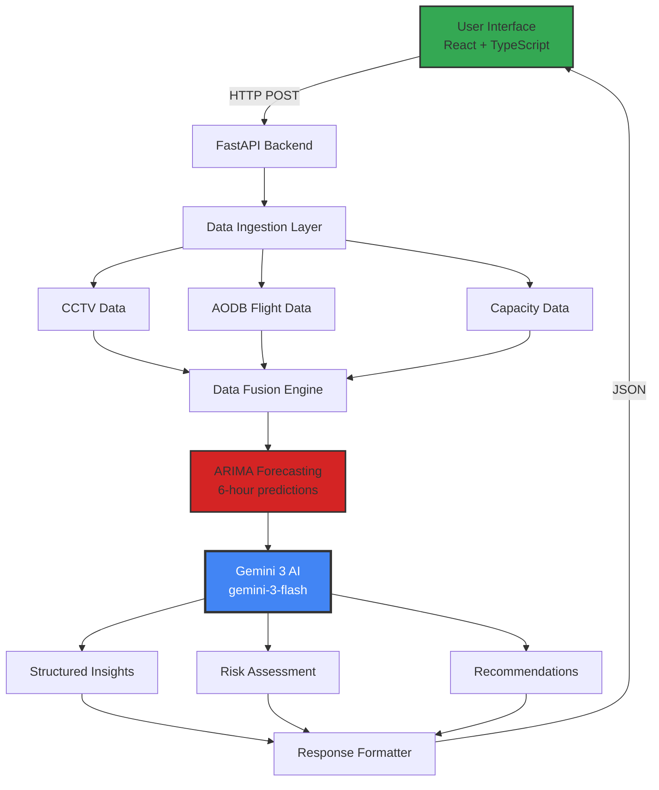

# AirFlow-AI
## 🏗️ Architecture

```mermaid
graph TB
    A[User Interface<br/>React + TypeScript] -->|HTTP POST| B[FastAPI Backend]
    B --> C[Data Ingestion Layer]
    C --> D[CCTV Data]
    C --> E[AODB Flight Data]
    C --> F[Capacity Data]
    D --> G[Data Fusion Engine]
    E --> G
    F --> G
    G --> H[ARIMA Forecasting<br/>6-hour predictions]
    H --> I[Gemini 3 AI<br/>gemini-3-flash]
    I --> J[Structured Insights]
    I --> K[Risk Assessment]
    I --> L[Recommendations]
    J --> M[Response Formatter]
    K --> M
    L --> M
    M -->|JSON| A
    
    style I fill:#4285f4,stroke:#333,stroke-width:3px,color:#fff
    style H fill:#d42424,stroke:#333,stroke-width:2px
    style A fill:#34a853,stroke:#333,stroke-width:2px
```
